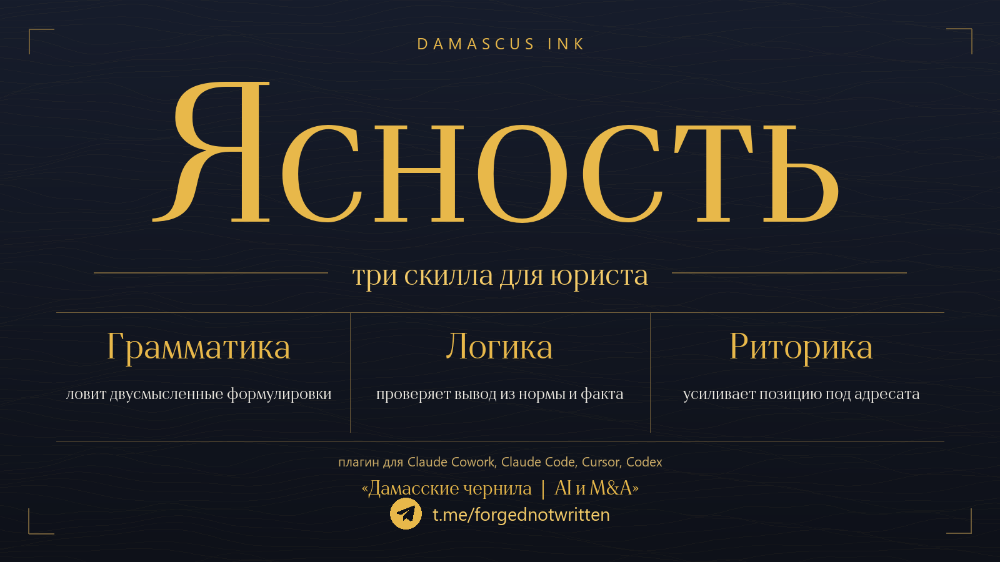

# Damascus Ink — маркетплейс юридических скиллов



## Ясность

Одно слово на всю витрину. **Ясность** — то, что тривиум даёт юридическому тексту: ясность **формы** (грамматика), ясность **вывода** (логика) и ясность **подачи** (риторика).

Единая «витрина», из которой ставятся все три открытых скилла Софьи Смирновой для юриста — **тривиум** проверки правового текста: **грамматика · логика · риторика**. Добавляете один маркетплейс — и любой из трёх скиллов ставится в пару кликов.

> Проект [Damascus Ink](https://damascus-ink.ru). Скиллы бесплатные (MIT) и работают внутри вашего ИИ-помощника (Claude Code, Cursor, Codex, Claude Cowork).

## Три скилла

| Скилл | Что проверяет | Вопрос | Ссылки |
| --- | --- | --- | --- |
| **pravo-grammatika** | **Форму**: как написано | Однозначна ли формулировка? | [GitHub](https://github.com/sky-magenta/pravo-grammatika) · [страница](https://sky-magenta.github.io/pravo-grammatika/) |
| **pravo-logika** | **Валидность**: следует ли вывод | Следует ли вывод из посылок? | [GitHub](https://github.com/sky-magenta/pravo-logika) · [страница](https://sky-magenta.github.io/pravo-logika/) |
| **pravo-ritorika** | **Убедительность**: примет ли адресат | Примет ли вывод адресат? | [GitHub](https://github.com/sky-magenta/pravo-ritorika) · [страница](https://sky-magenta.github.io/pravo-ritorika/) |

Естественный порядок работы над текстом — **грамматика → логика → риторика**: сначала однозначна ли форма, потом валиден ли вывод, потом примет ли его адресат. Каждый скилл самостоятелен; ставьте один, два или все три.

## Установка

### В Claude Cowork (мышкой, без командной строки)

Cowork — рабочее пространство в приложении Claude (macOS и Windows; нужен платный план: Pro, Max, Team или Enterprise).

1. Откройте вкладку **Cowork**, затем в левой панели — меню **Customize** («Настроить»).
2. Перейдите на вкладку **Plugins** → в разделе **Personal plugins** нажмите **«+»** → **Add marketplace**.
3. Выберите **Add from a repository** и укажите `sky-magenta/damascus-ink-plugins`. Маркетплейс синхронизируется.
4. Найдите нужные плагины (**pravo-grammatika**, **pravo-logika**, **pravo-ritorika**) и нажмите **Install** у каждого.
5. Готово. Наберите **«/»** или нажмите **«+»** в чате Cowork — появятся скиллы и их слэш-команды; либо просто попросите словами: «проверь формулировку», «проверь правовую логику», «разбей мою позицию».

MCP-серверов у плагинов нет — только текстовые файлы скиллов и слэш-команды. Официальная инструкция Anthropic — [«Use plugins in Claude»](https://support.claude.com/en/articles/13837440-use-plugins-in-claude).

### В Claude Code

Добавьте маркетплейс один раз, дальше ставьте нужные скиллы:

```
/plugin marketplace add sky-magenta/damascus-ink-plugins
/plugin install pravo-grammatika@damascus-ink
/plugin install pravo-logika@damascus-ink
/plugin install pravo-ritorika@damascus-ink
```

Ставьте только те, что нужны. Проверка — `/plugin`.

### Как папки-скиллы (Claude Code · Cursor · Codex)

Если плагины недоступны — каждый скилл можно поставить папкой; инструкция в README соответствующего репозитория (ссылки в таблице выше).

## Как это устроено

Этот репозиторий — только каталог (`.claude-plugin/marketplace.json`): он перечисляет три плагина и указывает, из каких репозиториев их брать. Файлы самих скиллов живут в своих репозиториях и подтягиваются автоматически — здесь их копий нет (никаких сабмодулей). Обновили скилл в его репозитории — маркетплейс отдаёт свежую версию без правок здесь.

## Об авторе

**Автор — [Софья Смирнова](https://damascus-ink.ru)** ([Telegram: «Дамасские чернила | AI и M&A»](https://t.me/forgednotwritten)), советник корпоративной практики и M&A, руководитель практики AI & Legal Tech в [O2 Consulting](https://o2consult.com); основатель платформы [Moire AI](https://moire-ai.tech). Скиллы — открытые инструменты из собственной практики. Все три под лицензией **MIT**.

## Лицензия

MIT © 2026 Sofya Smirnova ([t.me/forgednotwritten](https://t.me/forgednotwritten)). Каталог маркетплейса — оригинальная работа автора; каждый скилл лицензируется в своём репозитории (все — MIT).
